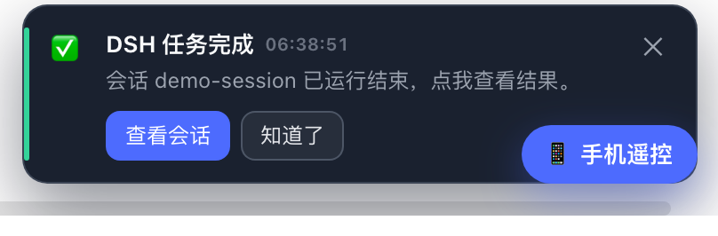
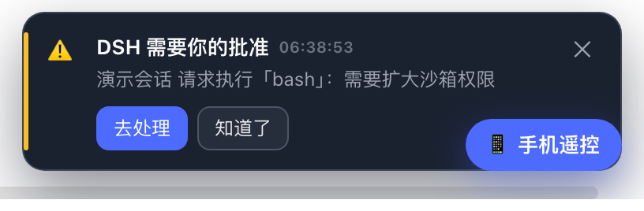
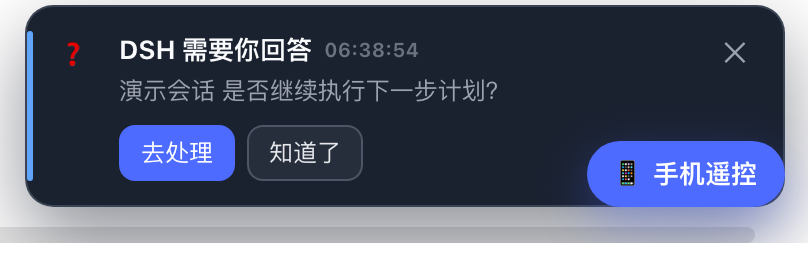

# @dsh-external/dsh-notifier

DSH 的任务提醒插件：**任务运行结束**、**运行中需要你做决策（权限审批 / 用户提问）**时弹出显眼的提醒——类似 Codex / Claude Code 的「完成 / 待确认」通知体验。

- **web 内 toast 弹窗**：挂在 DSH 官方 `shell.overlay` 浮层，深色通知卡片 + 提示音，右下角堆叠展示
- **原生桌面通知**：host 侧监听运行时事件，macOS（`osascript`）/ Linux（`notify-send`）/ Windows（PowerShell 气泡）尽力而为
- **决策型弹窗钉住不放**：审批 / 提问被回答、被拒绝后才自动消失；任务结束弹窗 6 秒自动消失
- **点卡片直达会话**：任务完成 → 打开对应会话；需要决策 → 跳过去处理

## 效果截图

| 任务完成 | 需要批准 | 需要回答 |
| --- | --- | --- |
|  |  |  |

## 工作原理

| 提醒 | web 弹窗信号（client） | 桌面通知信号（host） |
| --- | --- | --- |
| 任务结束 | `events.host` 流 `host/session-status`：`running: true → false` 边沿 | `agent/status`：`running → idle` 边沿 |
| 权限审批 | `events.mux` 流 `approval/requested` / `approval/resolved` | `session/event`：`approval/asked`（waterfall `approval/request` 作为辅助观察面） |
| 用户提问 | `events.mux` 流 `question/requested` / `question/resolved` | `session/event`：`tool/call`（`ask_user_question`） |
| 任务出错 | `events.host` 流 `host/agent-error` | `agent/error` |

client 用 `ctx.connection` 直接消费 DSH 的两条实时事件流，断线自动重连；弹窗组件通过 React portal 挂到 `document.body`，保证浮在任何面板之上。host 与 client 相互独立，任一失效不影响另一半。

## 安装

### 方式一：GitHub Release 安装（推荐）

1. 到 [Releases](https://github.com/nanami-0713/dsh-notifier/releases) 下载 `dsh-notifier-<版本>.tgz`
2. 解压，然后把插件装进 web profile：

```bash
dsh plugin --profile web add <解压目录>
# 或：编辑 ~/.dsh/profiles/web/package.json：
#   "dependencies": { "@dsh-external/dsh-notifier": "link:<解压目录>" },
#   "dsh": { "profile": { "bundles": [..., "@dsh-external/dsh-notifier"] } }
dsh web   # 重启后自动装配
```

### 方式二：源码构建安装

```bash
git clone https://github.com/nanami-0713/dsh-notifier.git
cd dsh-notifier
npm install
npm run build:all          # 产物：lib/index.js（host）+ lib/client.js（web 弹窗）
dsh plugin --profile web add .
```

### 注入器环境（dev_* 工具）

```bash
# 构建并运行时注入（免重启）
dev_build_plugin {"dir": "<本目录>"}
dev_inject_plugin {"dir": "<本目录>"}
# 持久化安装（写 profile package.json + bundles，重启仍生效）
dev_install_package {"dir": "<本目录>"}
```

## 配置

插件接受可选配置（loader `config` / patch 中的 `config` 字段），全部有默认值：

| 字段 | 默认 | 说明 |
| --- | --- | --- |
| `desktop` | `true` | 是否发操作系统原生桌面通知 |
| `quietSeconds` | `8` | 同一事件的最短重复提醒间隔（秒） |

## 验收测试

仓库自带三个真实事件级 E2E 脚本（用 DSH host API 建会话、派任务、监听事件流）：

```bash
node scripts/e2e-done.mjs       # 任务结束：host/session-status idle 帧
node scripts/e2e-approval.mjs   # 权限审批：approval/requested 帧（测完自动拒绝）
node scripts/e2e-question.mjs   # 用户提问：question/requested 帧
node scripts/ui-test.mjs        # Headless Chrome 全链路：真实事件 → 页面弹窗 → 截图
```

UI 测试会产出 `docs/screenshots/*.png`，并在结束后把测试会话归档清理。

## License

MIT
