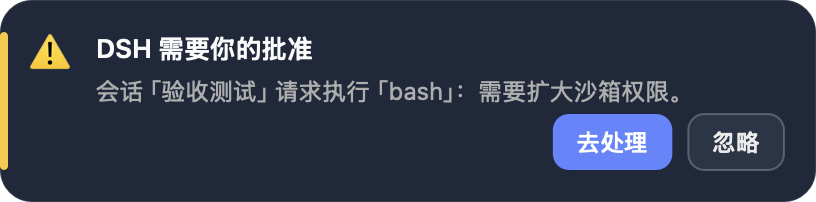

# @dsh-external/dsh-notifier

DSH 的任务提醒插件：**任务运行结束**、**运行中需要你做决策（权限审批 / 用户提问）**时，弹出**跨窗口可见**的提醒——类似 Codex / Claude Code 的 Hook 通知体验：你切到任何应用、任何桌面空间（甚至全屏应用）都能看到。

- **跨窗口悬浮面板（默认，v0.2）**：macOS 用内置 Swift notifier（NSPanel `.floating` + `canJoinAllSpaces` + `fullScreenAuxiliary`），浮在**所有应用窗口之上、所有 Space / 全屏应用之上**；样式与网页 toast 同款，「去处理 / 查看会话」按钮直接唤起浏览器打开 DSH
- **web 内 toast 弹窗**：DSH 网页里的右下角深色通知卡片 + 提示音（React portal 挂在 `document.body`，保证浮在面板之上）
- **系统通知中心横幅**：macOS `osascript` / Linux `notify-send` / Windows 气泡，可配置关闭
- **决策型弹窗钉住不放**：审批 / 提问在 web 端被回答、被拒绝后，悬浮面板自动消失；任务结束/出错面板 10 秒自动消失
- **设置页可视化配置（v0.3）**：左下角「设置」新增「提醒通知」页，内置 4 套预设（默认 / 顶部浅色 / 专注 / 仅系统弹窗），可调 toast 位置、主题、宽度、圆角、停留时长、提示音、同屏数量与系统级开关；修改实时生效并保存到 `~/.dsh/plugins/dsh-notifier/config.json`

## 效果截图

跨窗口悬浮面板与网页内 toast 使用同一套卡片设计，下面即实际样式：

| 任务完成 | 需要批准 | 需要回答 |
| --- | --- | --- |
|  |  |  |

## 工作原理

事件 → Hook（host 插件）→ 系统提醒，与 Claude Code 的 Notification Hook 同构：

| 提醒 | 触发事件（host Hook） | web 弹窗信号（client） |
| --- | --- | --- |
| 任务结束 | `agent/status`：`running → idle` 边沿 | `events.host` 流 `host/session-status`：`running: true → false` 边沿 |
| 权限审批 | `session/event`：`approval/asked`（waterfall `approval/request` 辅助观察）；`approval/decided` 关闭面板 | `events.mux` 流 `approval/requested` / `approval/resolved` |
| 用户提问 | `session/event`：`tool/call`（`ask_user_question`）；对应 `tool/result` 关闭面板 | `events.mux` 流 `question/requested` / `question/resolved` |
| 任务出错 | `agent/error` | `events.host` 流 `host/agent-error` |

- client 用 `ctx.connection` 消费两条实时事件流，断线自动重连；host 与 client 相互独立，任一失效不影响另一半
- 跨窗口提醒的机制随操作系统不同，见下一节「平台差异与要求」

## 平台差异与要求

网页内 toast 在三个平台完全一致（任何浏览器）。**跨窗口系统弹窗**按平台选择不同实现，行为对比如下：

| 能力 | macOS | Windows | Linux |
| --- | --- | --- | --- |
| 弹窗机制 | 内置 Swift notifier 悬浮卡片（NSPanel `.floating`，**跨桌面 Space / 全屏应用可见**） | Windows 自带 PowerShell + `WScript.Shell.Popup` 系统弹窗 | `zenity` 系统对话框 |
| 首次使用依赖 | 需要 **Xcode Command Line Tools**（`swiftc`），首次触发自动编译并缓存到 `~/.dsh/plugins/dsh-notifier/DSHNotifier`；无 `swiftc` 自动回退 `osascript display dialog / notification` | **无额外依赖**（`powershell.exe` 系统自带） | 需要 `zenity`（多数发行版：`sudo apt install zenity` / `dnf install zenity`）；无 zenity 时退化为 `notify-send` 横幅 |
| 任务结束 / 出错 | 10 秒自动消失 | 10 秒自动消失 | 10 秒自动消失 |
| 审批 / 提问 | 钉住，网页端处理完自动关闭 | 钉住，网页端处理完自动关闭 | 钉住，网页端处理完自动关闭 |
| 「去处理」按钮 | 点击直接打开 DSH（`webUrl`） | 弹窗点 Yes 打开 DSH | 弹窗点 OK 后 `xdg-open` 打开 DSH |
| 外观 | 与网页 toast 同款深色卡片 | **系统对话框样式**（不可自定义） | **系统对话框样式**（不可自定义） |
| 虚拟桌面 / 全屏 | 支持（`canJoinAllSpaces` + `fullScreenAuxiliary`） | 弹窗会置顶，跨虚拟桌面行为以系统为准 | 随桌面环境（GNOME/KDE）行为 |
| 实测状态 | ✅ 本仓库真机验收（窗口枚举确认 `.floating` 层上屏） | ⚠️ 未在 Windows 真机验证，欢迎 issue 反馈 | ⚠️ 未在 Linux 真机验证，欢迎 issue 反馈 |

如果不想弹系统级弹窗，可在「设置 → 提醒通知」里关闭，或把插件配置里的 `floating` 设为 `false`（只保留通知中心横幅 + 网页 toast）。

## 安装

### 方式一：GitHub Release 安装（推荐）

1. 到 [Releases](https://github.com/nanami-0713/dsh-notifier/releases) 下载最新 `dsh-external-dsh-notifier-<版本>.tgz`
2. 解压，然后把插件装进 web profile：

```bash
dsh plugin --profile web add <解压目录>
# 或：编辑 ~/.dsh/profiles/web/package.json：
#   "dependencies": { "@dsh-external/dsh-notifier": "link:<解压目录>" },
#   "dsh": { "profile": { "bundles": [..., "@dsh-external/dsh-notifier"] } }
dsh web   # 重启后自动装配
```

### 方式二：源码构建安装

```bash
git clone https://github.com/nanami-0713/dsh-notifier.git
cd dsh-notifier
npm install
npm run build:all          # 产物：lib/index.js（host）+ lib/client.js（web 弹窗）
dsh plugin --profile web add .
```

### 注入器环境（dev_* 工具）

```bash
# 构建并运行时注入（免重启）
dev_build_plugin {"dir": "<本目录>"}
dev_inject_plugin {"dir": "<本目录>"}
# 持久化安装（写 profile package.json + bundles，重启仍生效）
dev_install_package {"dir": "<本目录>"}
```

## 配置

**推荐：设置页可视化配置**。打开左下角「设置 → 提醒通知」，切换预设或修改任意字段都会实时生效，并自动保存到：

```
~/.dsh/plugins/dsh-notifier/config.json
```

配置通过同源 API 读写：`GET/PUT /api/dsh-notifier/config`。

**兼容：loader 配置**。插件仍接受 `config` / patch 里的部署默认配置，全部有默认值：

| 字段 | 默认 | 说明 |
| --- | --- | --- |
| `preset` | `default` | 内置预设：`default` / `top-light` / `focus` / `native-only` |
| `toast.enabled` | `true` | 是否在 DSH 网页内显示 toast |
| `toast.position` | `bottom-right` | `bottom-right` / `bottom-left` / `top-right` / `top-left` |
| `toast.theme` | `dark` | 深色 / 浅色卡片 |
| `toast.width` | `380` | 弹窗宽度 px（320–560） |
| `toast.radius` | `14` | 卡片圆角 px（6–20） |
| `toast.sound` | `true` | 提示音 |
| `toast.durationSeconds` | `6` | 普通提示停留秒数（4–30） |
| `toast.errorDurationSeconds` | `10` | 错误提示停留秒数（4–30） |
| `toast.maxCount` | `6` | 同屏最多卡片数（1–10） |
| `floating` | `true` | 跨窗口系统弹窗（macOS Swift notifier / Windows PowerShell `WScript.Shell.Popup` / Linux zenity） |
| `desktop` | `true` | 系统通知中心横幅 |
| `webUrl` | `$DSH_WEB_URL` 或 `http://127.0.0.1:3080` | 悬浮面板「去处理 / 查看会话」按钮打开的地址 |
| `quietSeconds` | `8` | 同一事件的最短重复提醒间隔（秒） |

## 验收测试

仓库自带真实事件级 E2E 脚本（用 DSH host API 建会话、派任务、监听事件流）：

```bash
node scripts/e2e-done.mjs       # 任务结束：host/session-status idle 帧 → 悬浮面板上屏
node scripts/e2e-approval.mjs   # 权限审批：approval/requested 帧 → 悬浮面板钉住，拒绝后自动关闭
node scripts/e2e-question.mjs   # 用户提问：question/requested 帧
node scripts/ui-test.mjs        # Headless Chrome 全链路：真实事件 → 网页 toast → 截图
```

macOS 上可用 CoreGraphics 窗口枚举验证面板确实浮在屏幕上（`kCGWindowLayer == 3` 即 `.floating` 层）：

```bash
swiftc scripts/winlist.swift -o /tmp/winlist && /tmp/winlist
```

UI 测试只截取弹窗局部（`Page.captureScreenshot` clip，不含页面其他区域），输出到不入库的 `.artifacts/ui/`，并在结束后把测试会话归档清理。仓库中正式截图只保留 `docs/screenshots/native/` 一套。

## License

MIT
